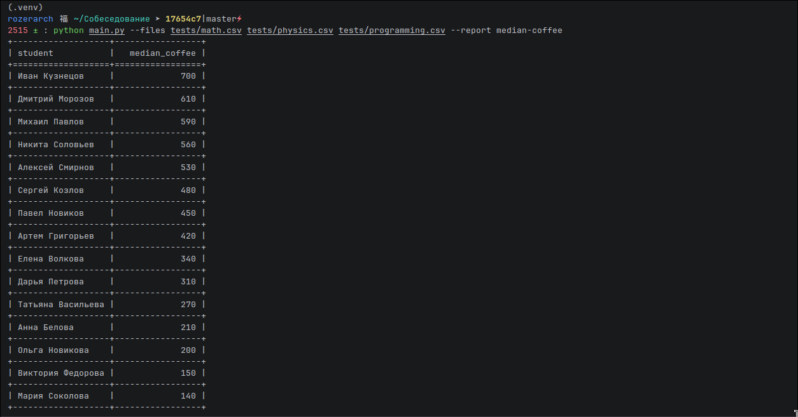
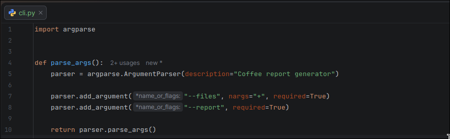
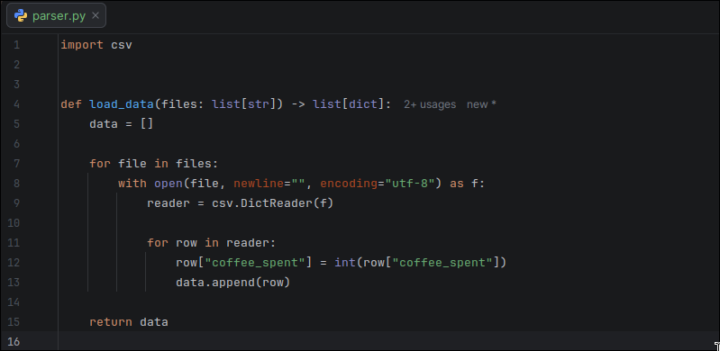
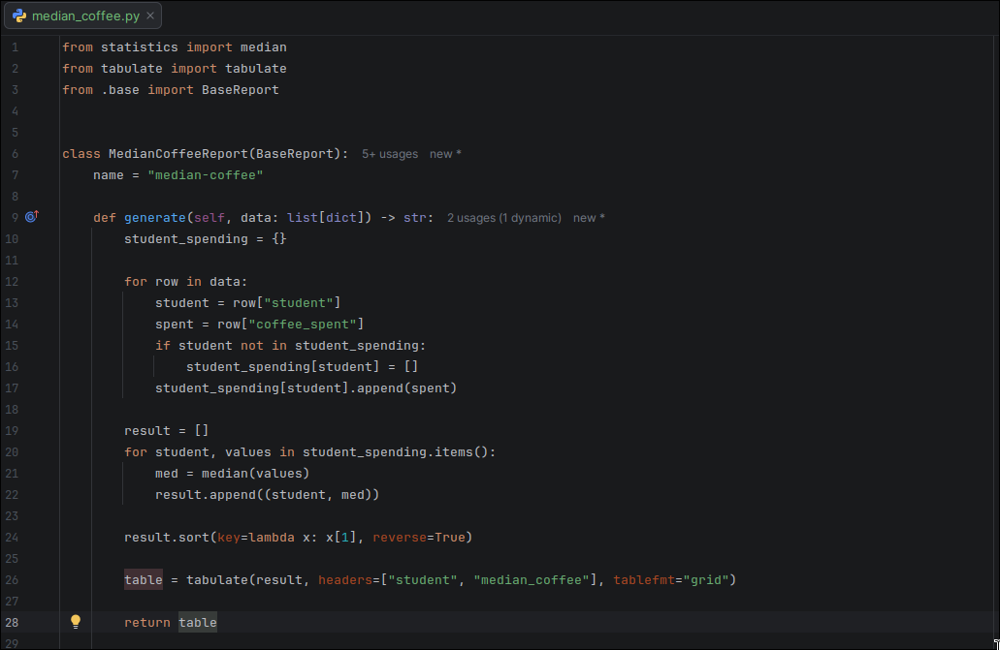

#  **пример запуска**

## cli.py

 настройка приема файлов и вида отчета с консоли

## parser.py

 обработка входящих файлов с помощью csv и передача информации в массив data

## median_coffee.py

 класс для вывода итоговой информации на экран наследуется от абстрактного класса 
BaseReport из base.py